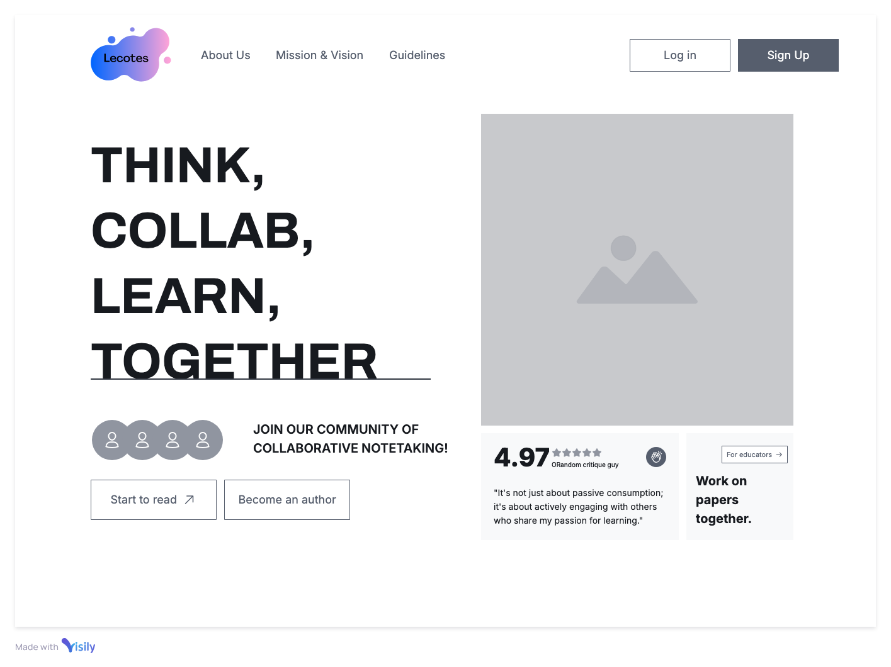
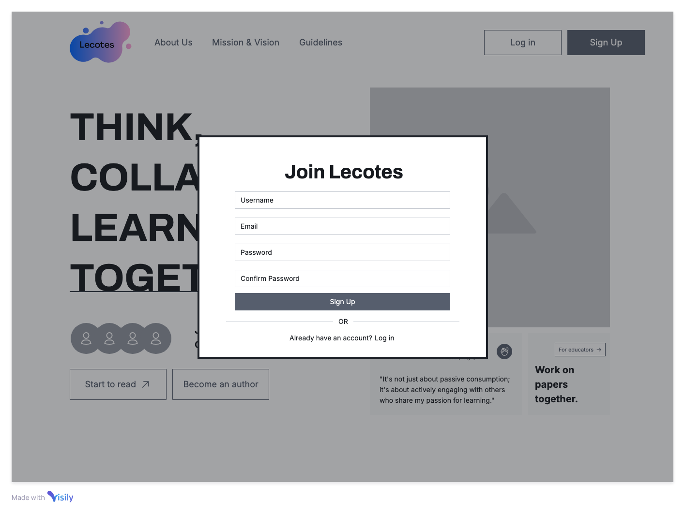
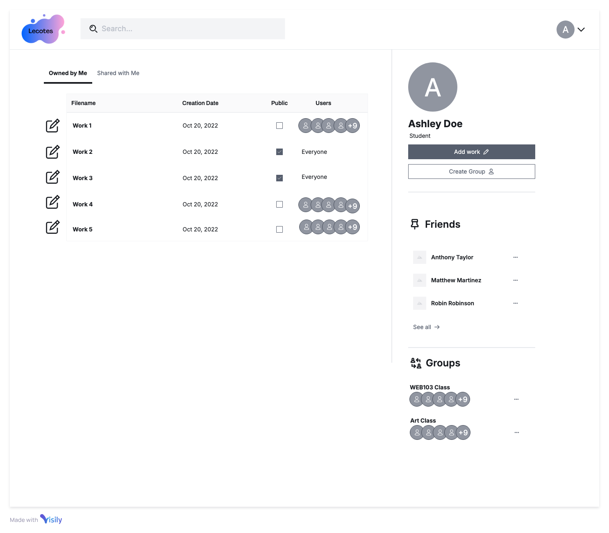
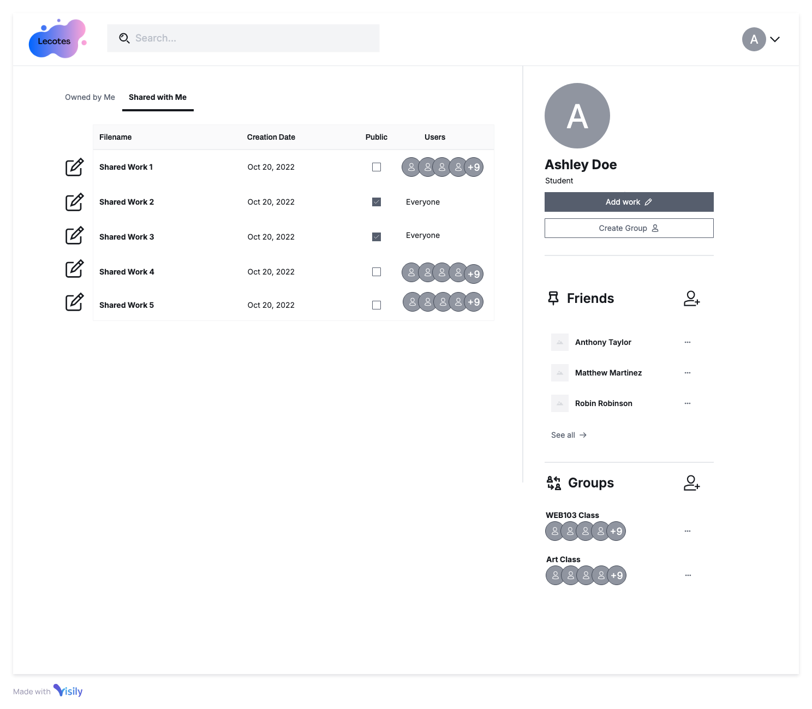
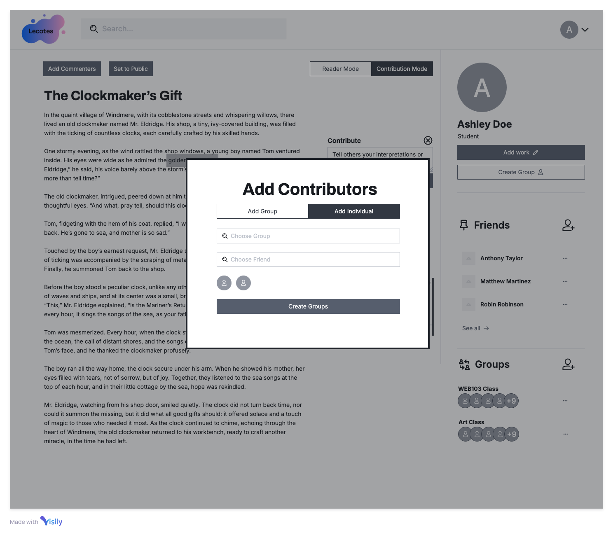
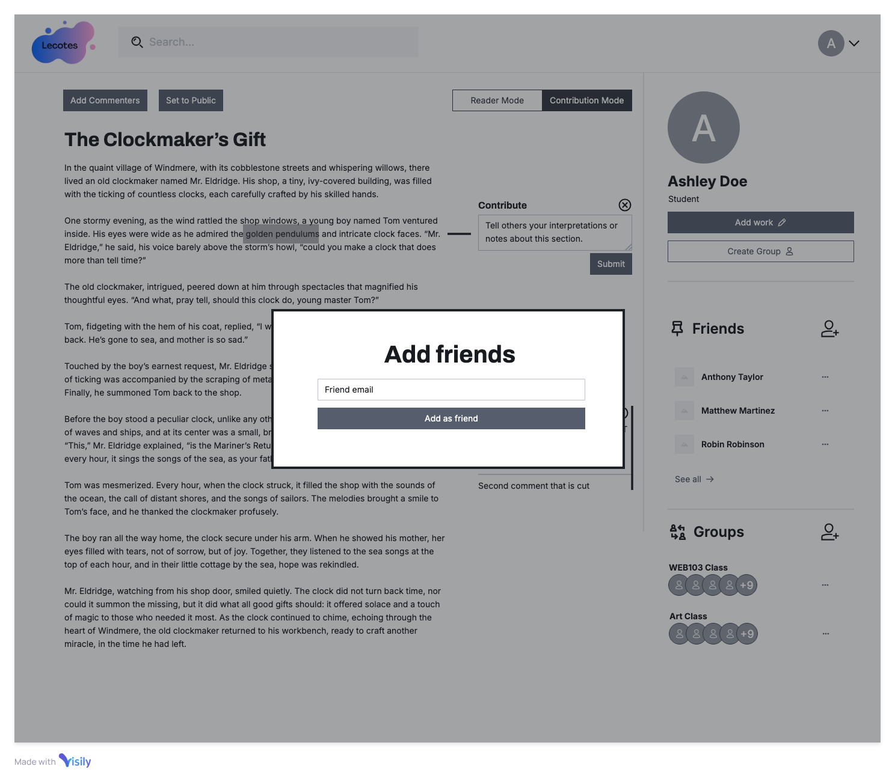

# Wireframes

Reference the Creating an Entity Relationship Diagram final project guide in the course portal for more information about how to complete this deliverable.

## List of Pages

* Landing Page
  * Signup Modal
  * Login Modal
* User Dashboard
  * My Files State
  * Shared Files State
* Workview
  * Add text
  * Add Contrbutions (Comments) Modal
    * Upvote downvote
  * Add Friends Modal
  * Create Group Modal

## Wireframe 1: Landing Page

## Wireframe 2: Signup_Login

## Wireframe 3: User Dashboard

## Wireframe 4: User Dashboard #2

## Wireframe 5: Workview & Add Contribution

## Wireframe 6: Workview, Add Contributor

## Wireframe 7: Workview, Add Friends

## Wireframe 8: Workview, Create Groups

